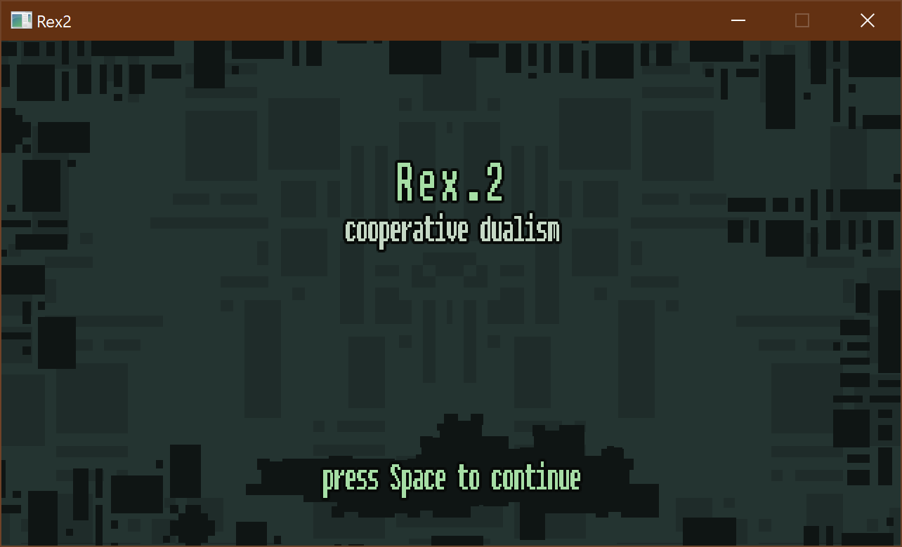
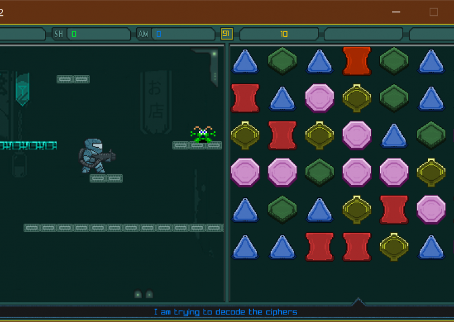
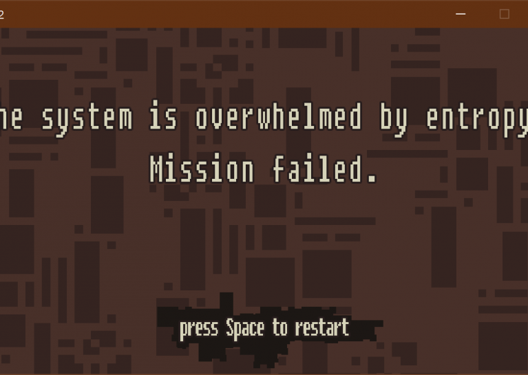

# Rex2

[Rex2](https://globalgamejam.org/2022/games/rex2-5) is game prepared for Global Game Jam 2022 (theme: "duality"), during [LubJam 2022](https://globalgamejam.org/2022/jam-sites/lubjam-2022).

> Rex, a space renegade, is taken into the computer to fight evil viruses, who have taken over.
>
> However he's not alone; Norma, AI, is deciphering viruses' codes to give him additional buffs while's busy jumping and shooting. And in the meantime, she's providing useful commentary, but also singing much to Rex's annoyance.
>
> A two-player co-op game. The Player 1 (left) is moving the player's avatar using A/LEFT, D/RIGHT and W/SPACE to jump, where shooting is left or right CTRL. But to shoot, you need AMMO! When you crash with the virus, your HP or SHIELD lowers! To provide resources for you, this is player 2's (right) job. Using a mouse, try to match at least of 3 fragments of virus' ciphers represented as crystals to destroy them. Red will provide HP, green will provide SHIELD, blue will provide AMMO. Yellow will give you additional time. If more than 3 were matched, buffs are greater. Yet, the number of moves is limited - Player 1 need's to get shiny crystal to give Player 2 more moves.

## Diversifiers

"Duality" is achieved on a few levels - there is "2" in the game title, the game is for two players, two games inside are very different, and there is a dualism of human (Rex) and machine (Norma).

* 20th Century Gaming - Your game's visuals are in the style of games from a device released before the year 2000 ,
* Take A Break - Each member of the team has to take at least one break every 2-3 hours,
* Brxu Vhfuhw lv Vdih zlwk Ph - Include cryptography and ciphers in the gameplay or narrative of your game!

## Technology notes

Built using C# programming language and .NET 6, [Raylib](https://www.raylib.com/) game engine and [raylib-cs](https://github.com/ChrisDill/Raylib-cs/issues) wrapper.

Built for Windows and Linux, probably should also work on MacOS. Builds are available in the Releases section.

## Credits

Code: [Marcin "Ktos" Badurowicz](https://ktos.info)

Graphics: [Stanisław Skulimowski](https://stanislawskulimowski.com)

Assets:

* [darknes by surt](https://opengameart.org/content/darknes),
* [SpriteLib](https://www.widgetworx.com/spritelib/) by Ari Feldman,
* EEEnt-OFFICIAL,
* [Pixel Ship Generator](https://thydungeonsean.itch.io/pixel-ship-generator).

Music: Marylka

Sounds: [Kenney](www.kenney.nl)

Licensed under [Creative Commons Attribution-NonCommercial-ShareAlike 3.0 (CC BY-NC-SA)](https://creativecommons.org/licenses/by-nc-sa/3.0/pl/).
